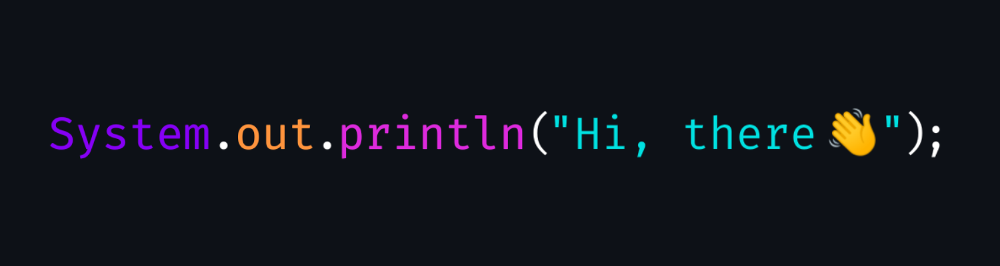

<!-- Header Badges -->

<h2></h2>

I'm a self-taught programmer from **Indonesia** 🇮🇩, and also a vocational school student.  
There's _nothing special_ about me. In my spare time, I'd like to read some materials about programming, and make some small projects to learn.

---

## 👾 My Tech Skills

## 🔭 My Statistics

<picture id="stats">
    <source 
            srcset="https://github-readme-stats.vercel.app/api?username=mitsuki31&show_icons=true&theme=tokyonight&include_all_commits=true&show_private=falsee&hide=stars"
            media="(prefers-color-scheme: dark)"
    />
    <source
            srcset="https://github-readme-stats.vercel.app/api?username=mitsuki31&show_icons=true&include_all_commits=true&show_private=false&hide=stars"
            media="(prefers-color-scheme: light), (prefers-color-scheme: no-preference)"
    />
    
</picture>

<picture id="top-langs">
    <source
            srcset="https://github-readme-stats.vercel.app/api/top-langs/?username=mitsuki31&layout=donut&theme=tokyonight&count_private=true&langs_count=10"
            media="(prefers-color-scheme: dark)"
    />
    <source
            srcset="https://github-readme-stats.vercel.app/api/top-langs/?username=mitsuki31&layout=donut&count_private=true&langs_count=10"
            media="(prefers-color-scheme: light), (prefers-color-scheme: no-preference)"
    />
    
</picture>

<picture id="profile-summary">
    <source
            srcset="https://github-profile-summary-cards.vercel.app/api/cards/profile-details?username=mitsuki31&theme=tokyonight"
            media="(prefers-color-scheme: dark)"
    />
    <source
            srcset="https://github-profile-summary-cards.vercel.app/api/cards/profile-details?username=mitsuki31&theme=github"
            media="(prefers-color-scheme: light), (prefers-color-scheme: no-preference)"
    />
    
</picture>

 

⚡ Recent Activities

<!--START_SECTION:activity-->
1. 💪 Opened PR [#4](https://github.com/mitsuki31/lsfnd/pull/4) in [mitsuki31/lsfnd](https://github.com/mitsuki31/lsfnd)
2. 🎉 Merged PR [#3](https://github.com/mitsuki31/lsfnd/pull/3) in [mitsuki31/lsfnd](https://github.com/mitsuki31/lsfnd)
3. 💪 Opened PR [#3](https://github.com/mitsuki31/lsfnd/pull/3) in [mitsuki31/lsfnd](https://github.com/mitsuki31/lsfnd)
4. 🎉 Merged PR [#2](https://github.com/mitsuki31/lsfnd/pull/2) in [mitsuki31/lsfnd](https://github.com/mitsuki31/lsfnd)
5. 🗣 Commented on [#2](https://github.com/mitsuki31/lsfnd/pull/2#issuecomment-2066979457) in [mitsuki31/lsfnd](https://github.com/mitsuki31/lsfnd)
6. 💪 Opened PR [#2](https://github.com/mitsuki31/lsfnd/pull/2) in [mitsuki31/lsfnd](https://github.com/mitsuki31/lsfnd)
7. 🎉 Merged PR [#1](https://github.com/mitsuki31/lsfnd/pull/1) in [mitsuki31/lsfnd](https://github.com/mitsuki31/lsfnd)
8. 💪 Opened PR [#1](https://github.com/mitsuki31/lsfnd/pull/1) in [mitsuki31/lsfnd](https://github.com/mitsuki31/lsfnd)
9. 🚀 Published release [v0.1.0](https://github.com/mitsuki31/lsfnd/releases/tag/v0.1.0) in [mitsuki31/lsfnd](https://github.com/mitsuki31/lsfnd)
10. 🗣 Commented on [#96](https://github.com/mitsuki31/jmatrix/pull/96#issuecomment-1947670596) in [mitsuki31/jmatrix](https://github.com/mitsuki31/jmatrix)
<!--END_SECTION:activity-->

<picture>
  <!-- For dark theme -->
  <source
    srcset="https://raw.githubusercontent.com/mitsuki31/mitsuki31/output/github-snake-dark.svg"
    media="(prefers-color-scheme: dark)"
  />
  <!-- For light theme -->
  <source
    srcset="https://raw.githubusercontent.com/mitsuki31/mitsuki31/output/github-snake.svg"
    media="(prefers-color-scheme: light)"
  />
  <!-- Default -->
  
</picture>
